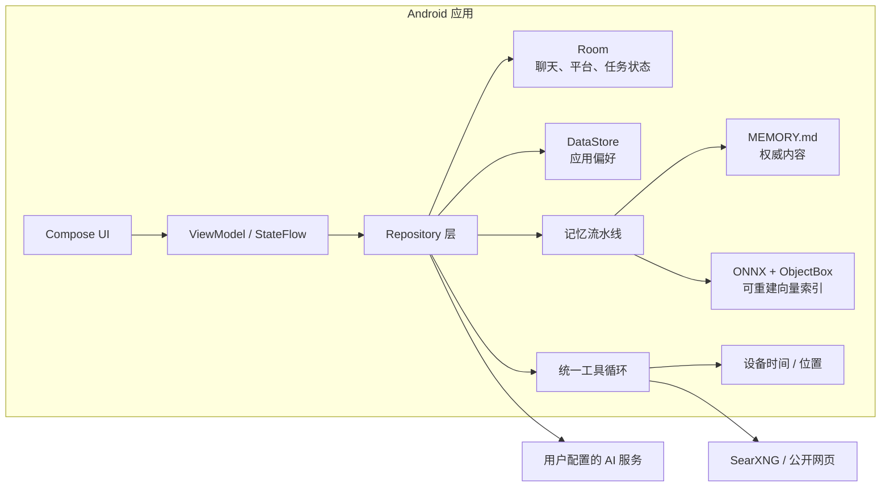

<div align="center">


# ChatWithChat

**面向 Android 的本地优先多模型 AI 助手**

在同一个移动端界面中连接主流模型服务与 OpenAI 兼容端点，并按需启用工具调用、联网搜索和跨会话长期记忆。

<p>
  
  
  
  <a href="./LICENSE"></a>
</p>

</div>

ChatWithChat 不提供项目方托管的账号、模型或 API 中转服务。你需要使用自己的模型服务凭据，或者连接本机、局域网中的 Ollama / OpenAI 兼容服务。聊天记录、设置和长期记忆由应用在本地管理；发生模型请求、联网搜索或记忆整理时，相关内容会发送到你配置的外部端点。

> [!IMPORTANT]
> 当前仓库处于活跃开发阶段，暂未提供 Google Play、F-Droid 或正式 GitHub Release 安装包。现阶段请从源码构建；GitHub Actions 生成的是临时构建产物，不等同于正式发布。

## 核心能力

| 能力 | 当前实现 |
| --- | --- |
| 多模型接入 | 支持 OpenAI、Anthropic、Google Gemini、Groq、OpenRouter、Ollama，以及自定义 OpenAI 兼容端点 |
| 移动端聊天 | 首屏直接开始对话，抽屉管理历史会话，顶部切换模型与思考强度 |
| 工具调用 | 统一的工具循环、参数校验、调用额度、权限检查和结果来源展示 |
| 联网搜索 | 通过用户配置的 SearXNG 搜索公开网页，并按需读取网页正文 |
| 长期记忆 | 以本地 Markdown 为事实源，结合端侧 ONNX 向量化与 ObjectBox 语义索引进行混合召回 |
| 丰富消息 | 流式回复、Markdown、代码块复制、数学公式、思考过程、来源链接和 Token 用量 |
| 会话操作 | 搜索、复制与批量删除历史会话，编辑消息、重试回答、切换回答版本并导出会话 |
| 图片附件 | 从相册或相机添加图片；单文件与单次附件总量上限均为 50 MiB，发送前会检查格式并压缩大图 |

## 支持的模型服务

添加平台后，应用会从服务端同步模型列表。你可以选择启用的模型、设置默认模型，并为支持的模型选择自动、关闭、低、中、高或最高思考强度。

| 服务类型 | 对话协议 | 工具调用路径 |
| --- | --- | --- |
| OpenAI | Responses API | 原生工具调用 |
| Anthropic | Messages API | 原生工具调用 |
| Google Gemini | Generate Content API | 原生工具调用 |
| OpenRouter | OpenAI Chat Completions | 原生工具调用 |
| Groq | OpenAI 兼容接口 | 结构化 JSON 回退 |
| Ollama | 本地 / 局域网 OpenAI 兼容接口 | 结构化 JSON 回退 |
| Custom | 自定义 OpenAI 兼容接口 | 结构化 JSON 回退 |

不同服务和模型支持的思考参数、视觉输入、上下文长度与工具能力并不完全一致，最终行为仍取决于目标端点的实际兼容程度。

## 快速开始

运行要求：

- Android 12（API 31）或更高版本。
- 至少一个可访问的模型服务端点。
- 对云端服务使用对应 API 密钥；Ollama 可在不配置密钥的情况下使用。

首次启动后：

1. 选择提供商类型并填写平台名称、API URL 与凭据。
2. 等待应用同步模型列表，然后启用至少一个模型。
3. 回到聊天首页，从顶部模型选择器选择模型与思考强度。
4. 如有需要，在设置中单独开启长期记忆、联网搜索或其他工具。

如果 Android 设备需要连接电脑上运行的 Ollama，请填写电脑在局域网中的地址；Android 设备里的 `localhost` 指向设备自身。

## 工具调用与联网搜索

工具总开关提供“关闭”和“自动”两种模式。自动模式下，模型可以在当前请求需要时调用已启用工具。当前内置工具均为只读工具：

| 工具 | 用途 | 启用条件 |
| --- | --- | --- |
| `web_search` | 搜索公开网页并返回结构化来源 | 工具调用为自动、联网搜索为自动，并已配置 SearXNG URL |
| `fetch_url` | 读取公开网页正文 | 与网页搜索相同 |
| `current_datetime` | 读取设备本地日期、时间与时区 | 工具调用为自动 |
| `device_location` | 按需读取设备当前位置 | 默认关闭，需要用户主动启用并授予 Android 定位权限 |

工具执行前会检查当前启用列表、参数 schema、调用次数、超时、结果大小和 Android 权限。模型生成的调用不会自行弹出系统授权窗口；缺少权限时，应用会返回可恢复错误，由用户决定是否授权。

当前不支持 MCP、远程动态工具、插件市场或任意第三方工具下载。工具平台的扩展方式和安全边界见 [工具调用开发指南](./docs/superpowers/tool-calling.md)。

## 长期记忆

长期记忆默认关闭。开启后，应用会把完成的对话按最多 5 轮一批，在达到批次阈值、会话空闲或上下文压缩时交给后台维护任务整理。该整理过程会调用你配置的模型服务，因此可能产生额外的 API 请求与用量。

当前记忆链路包含：

- `MEMORY.md`：长期记忆的本地权威内容。
- `memory/YYYY-MM-DD.md`：按日期保存、等待后续蒸馏的记忆内容。
- ONNX Runtime + `bge-small-zh-v1.5`：在设备上生成文本向量。
- ObjectBox HNSW：可删除、可从 Markdown 重建的派生向量索引。
- Hybrid recall：融合关键词与向量结果；端侧 embedding 模型或向量索引不可用时退回当前 Markdown 的关键词召回。

记忆页面提供当前长期记忆的只读查看、Markdown 导出，以及生成、整理和维护任务的活动记录。更完整的实现、恢复与发布验证见 [端侧向量记忆就绪文档](./docs/architecture/on-device-vector-memory-readiness.md)。

## 数据与隐私边界

“本地优先”描述的是数据归属和默认存储位置，不代表所有功能都能离线运行。

| 数据或操作 | 存储 / 传输边界 |
| --- | --- |
| 聊天、平台和运行状态 | 保存在应用私有 Room 数据库中；平台记录包含 API URL 与凭据 |
| 应用偏好 | 保存在应用私有 DataStore 中 |
| API 凭据 | 没有经过项目自建服务器，但当前也没有额外的应用层加密 |
| 普通对话与模型列表同步 | 直接请求所选模型服务端点 |
| 联网搜索 | 查询发送到用户配置的 SearXNG；网页正文由应用从公开 URL 读取 |
| 长期记忆 | Markdown 与向量索引保存在本地；语义整理会把所需上下文发送到所选模型服务 |
| 设备位置 | 仅在用户主动启用并授权后读取；调用结果会进入所选模型的对话上下文 |

当前 Android 备份规则没有排除 Room、DataStore 或平台凭据。这些数据是否进入系统云备份或设备迁移，取决于设备的 Android 备份设置与传输实现。

## 本地开发

### 环境要求

- JDK 17。
- Android Studio 与 Android SDK 36。
- Windows PowerShell，或能运行 Gradle Wrapper 的类 Unix 环境。
- 设备测试需要 Android 12+ 真机或模拟器。

项目是单 `app` 模块，`namespace` 与 `applicationId` 均为 `cn.nabr.chatwithchat`。

```powershell
git clone https://github.com/NaBr406/ChatWithChat.git
Set-Location ChatWithChat

# Debug APK
.\gradlew.bat :app:assembleDebug

# Kotlin 快速编译检查
.\gradlew.bat :app:compileDebugKotlin

# JVM 单元测试
.\gradlew.bat :app:testDebugUnitTest

# 连接设备后的 instrumented tests
.\gradlew.bat :app:connectedDebugAndroidTest
```

macOS / Linux 下将 `.\gradlew.bat` 替换为 `./gradlew`。代码格式由 ktlint 1.3.1 按 `.editorconfig` 在 Pull Request 中检查。

### Windows 构建脚本

```powershell
# 默认构建 arm64-v8a Debug APK，输出到 dist/
.\build-apk.ps1

# 为 x86_64 模拟器构建
.\build-apk.ps1 -TargetAbi x86_64

# 构建、安装并启动 Debug APK
.\run-on-emulator.ps1

# 复用已有 Debug APK
.\run-on-emulator.ps1 -NoBuild
```

`build-apk.ps1` 也接受 `armeabi-v7a` 和 `x86`，但当前生产兼容验证重点是 `arm64-v8a` 与 `x86_64`；32 位 ABI 仍需单独验证。

### Release 构建

生产 Release 包含固定版本、固定哈希的端侧记忆模型。模型二进制不提交到 Git，干净工作区需要先准备并校验资产：

```powershell
.\tools\memory-model\provision-bge-small-zh-v1.5-production.ps1
.\gradlew.bat :app:assembleRelease
.\gradlew.bat :app:bundleRelease
```

也可以使用仓库脚本完成模型准备、单 ABI 构建、签名和 APK 检查：

```powershell
.\build-apk.ps1 -Release
```

未传入 `-Keystore` 时，脚本会使用本机 Debug keystore 生成便于安装验证的 Release 变体。正式分发必须传入自己的发布 keystore，并妥善管理密钥与密码。模型资产的来源和完整性约束见 [端侧记忆模型资产契约](./docs/architecture/on-device-vector-memory-artifact-contract.md)。

## 架构概览



主要代码目录：

- `app/src/main/kotlin/cn/nabr/chatwithchat/presentation/`：Compose UI、导航与 ViewModel。
- `app/src/main/kotlin/cn/nabr/chatwithchat/data/network/`：各模型服务的网络客户端。
- `app/src/main/kotlin/cn/nabr/chatwithchat/data/repository/`：聊天、设置、附件和模型发现流程。
- `app/src/main/kotlin/cn/nabr/chatwithchat/data/tool/`：工具注册、执行、安全策略与 provider adapter。
- `app/src/main/kotlin/cn/nabr/chatwithchat/data/websearch/`：SearXNG 搜索、网页提取与网络安全策略。
- `app/src/main/kotlin/cn/nabr/chatwithchat/data/memory/`：Markdown 记忆、维护任务、端侧 embedding 与 Hybrid recall。
- `app/src/main/kotlin/cn/nabr/chatwithchat/data/database/`：Room entity、DAO 与 schema migration。
- `app/src/test/kotlin/`、`app/src/androidTest/kotlin/`：JVM 与设备测试。

技术栈包括 Kotlin、Jetpack Compose、Material 3、Hilt、Room、DataStore、WorkManager、Ktor CIO、kotlinx.serialization、ObjectBox 与 ONNX Runtime。

## CI 与发布流程

- Pull Request 会执行 ktlint 检查；相关代码变更会触发 Debug APK 构建。
- CodeQL 在 Pull Request 和每周定时任务中运行。
- 推送标签或手动触发 Release workflow 时，会准备记忆模型、构建并签名 APK / AAB，再上传为 Actions artifact。
- 当前 CI 不会运行完整 JVM / 设备测试，也不会自动创建 GitHub Release。

提交代码前，请至少运行与修改范围对应的单元测试和 `:app:compileDebugKotlin`；数据库、记忆、权限或 Android 生命周期改动还应补充设备测试。

## 反馈

- [提交 Bug](https://github.com/NaBr406/ChatWithChat/issues/new/choose)
- [查看 GitHub Actions](https://github.com/NaBr406/ChatWithChat/actions)

报告问题时，请附上 Android 版本、提供商类型、模型 ID、API URL 类型、复现步骤，以及必要的截图或 logcat 片段。请勿公开 API 密钥、完整请求头或其他敏感信息。

## 项目背景与许可证

ChatWithChat 基于 [GPT Mobile](https://github.com/Taewan-P/gpt_mobile) 持续改造，现使用独立的项目身份与 Android 包名 `cn.nabr.chatwithchat`。旧的 `dev.chungjungsoo.gptmobile` 安装包不会被 Android 视为本项目的原地升级版本，两者的数据也不会自动迁移。

本项目按 [GNU General Public License v3.0](./LICENSE) 发布。应用内“开源许可”页面列出了所使用第三方依赖的许可证信息。
