<div align="center">


# ChatWithChat

**面向 Android 的本地优先多模型 AI 助手**

在同一个移动端界面中连接主流模型服务与 OpenAI 兼容端点，并按需启用工具调用、联网搜索和跨会话长期记忆。

<p>
  
  
  
  <a href="https://github.com/NaBr406/ChatWithChat/releases/tag/v1.0.0"></a>
  <a href="./LICENSE"></a>
</p>

<p>
  <a href="https://github.com/NaBr406/ChatWithChat/releases/download/v1.0.0/1.0.0.apk"><strong>下载 v1.0.0 APK</strong></a>
  ·
  <a href="https://github.com/NaBr406/ChatWithChat/releases/tag/v1.0.0">查看发布说明</a>
  ·
  <a href="#本地开发">从源码构建</a>
</p>

</div>

ChatWithChat 不提供项目方托管的账号、模型或 API 中转服务。你需要使用自己的模型服务凭据，或者连接本机、局域网中的 Ollama / OpenAI 兼容服务。聊天记录、设置和长期记忆由应用在本地管理；发生模型请求、联网搜索或记忆整理时，相关内容会发送到你配置的外部端点。

> [!IMPORTANT]
> 当前稳定版为 `v1.0.0`，可从 [GitHub Release](https://github.com/NaBr406/ChatWithChat/releases/tag/v1.0.0) 下载 `1.0.0.apk`。APK 的 SHA-256 为 `446c645efeed83b9948fce9bc56435e716d44701c647b123fb1cc0adec5f0347`。项目尚未上架 Google Play 或 F-Droid，安装 GitHub APK 时需要允许浏览器或文件管理器安装未知来源应用。

## 核心能力

| 能力 | 当前实现 |
| --- | --- |
| 多模型接入 | 支持 OpenAI、Anthropic、Google Gemini、Groq、OpenRouter、Ollama，以及自定义 OpenAI 兼容端点 |
| 移动端聊天 | 首屏直接开始对话，抽屉管理历史会话，顶部切换模型与思考强度 |
| 推理流展示 | 统一接收 Responses reasoning summary、`reasoning_content`、`reasoning`、`<think>` 与 `<thinking>`，流式写入可折叠思考区 |
| 工具调用 | 统一的工具循环、参数校验、调用额度、权限检查和结果来源展示 |
| 联网搜索 | 通过用户配置的 SearXNG 搜索公开网页，并按需读取网页正文 |
| 长期记忆 | schema 17 记忆流水线，以 `MEMORY.md` 为权威事实源，结合端侧 ONNX、ObjectBox HNSW、混合召回和可恢复的原子写入 |
| 丰富消息 | 流式回复、Markdown、代码块复制、数学公式、思考过程、来源链接和 Token 用量 |
| 会话操作 | 搜索、复制与批量删除历史会话，编辑消息、重试回答、切换回答版本并导出会话 |
| 图片附件 | 从相册或相机添加图片；单文件与单次附件总量上限均为 50 MiB，发送前会检查格式并压缩大图 |

## 相较上游的主要改造

ChatWithChat 不只是更换了名称和图标。相较于 GPT Mobile 上游基础，本仓库已经替换或扩展了多个核心子系统：

| 方向 | 本项目实现 |
| --- | --- |
| 独立项目身份 | Android `namespace`、`applicationId`、资源、链接与构建产物迁移到 `cn.nabr.chatwithchat` / `NaBr406/ChatWithChat` |
| 模型与推理控制 | 统一模型发现和启用流程，按提供商映射自动、关闭、低、中、高、最高思考强度，并记住模型与思考模式选择 |
| 推理流兼容 | 新增跨 SSE 分片的 `ReasoningStreamParser`，处理结构化推理字段和思考标签，抑制重复来源，并让未闭合标签仍可见 |
| 聊天交互 | 增加回答轮次导航、回答版本切换、按平台与轮次统计 Token、用户/助手消息编辑、重试、导出，以及新建会话附件接力 |
| 附件链路 | 支持相册多选、相机拍照、本地缩略图、格式与容量准入、图片压缩，以及兼容端点不支持 Files API 时的内联回退 |
| 工具平台 | 建立统一工具注册、schema 校验、执行预算、超时、权限与来源展示，内置搜索、网页读取、设备时间和按需定位 |
| 长期记忆 | 新增完整的本地记忆子系统，包括五轮批处理、日记忆蒸馏、schema 17 恢复状态、原子 Markdown 提交、端侧向量索引与 Hybrid recall |
| 构建与交付 | 增加单 ABI 构建、APK 包名/版本/签名/ABI 校验、固定哈希记忆模型供应，以及 16 KB ZIP/ELF 兼容门禁 |

## 界面预览

<table>
  <tr>
    <td align="center">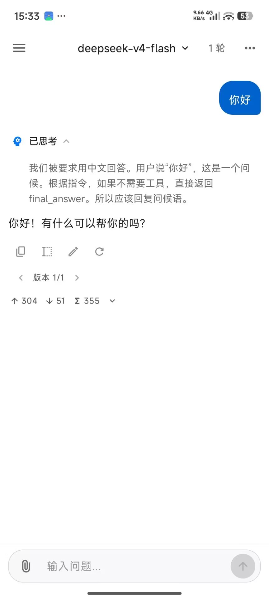<br><sub>回答与思考过程</sub></td>
    <td align="center">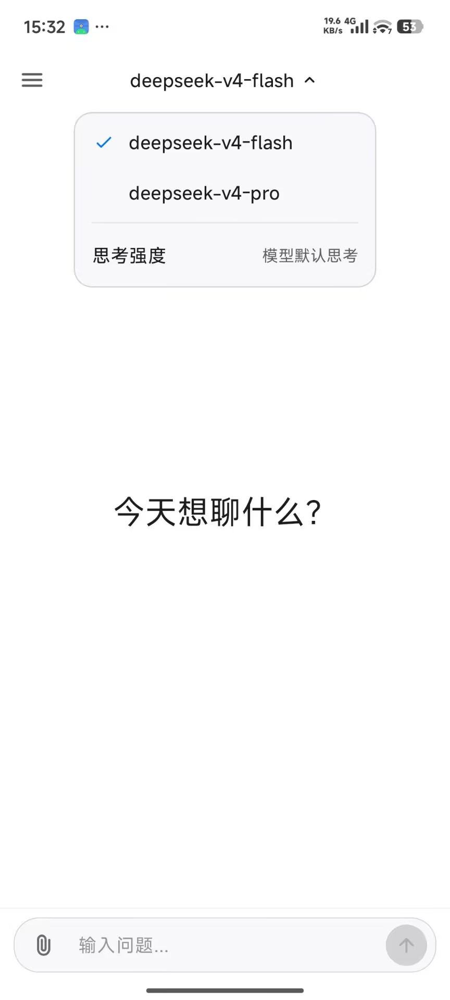<br><sub>模型与思考强度</sub></td>
    <td align="center">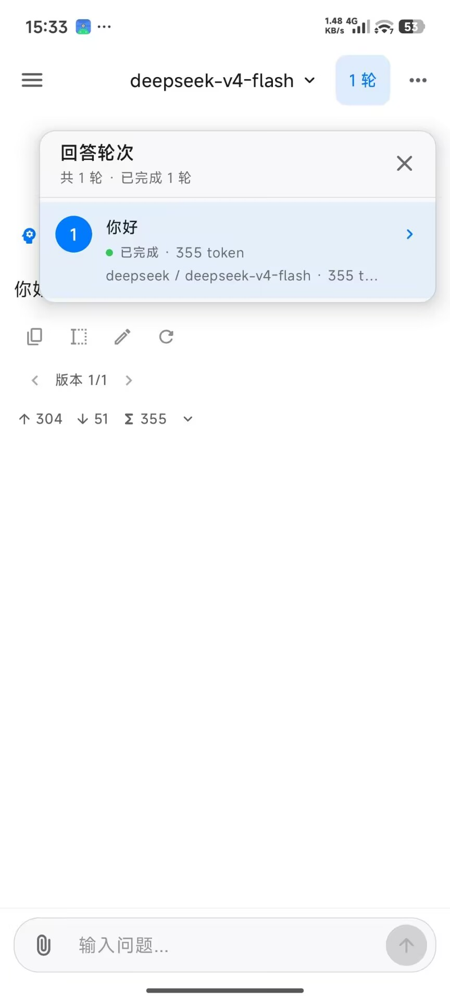<br><sub>回答轮次导航</sub></td>
  </tr>
  <tr>
    <td align="center">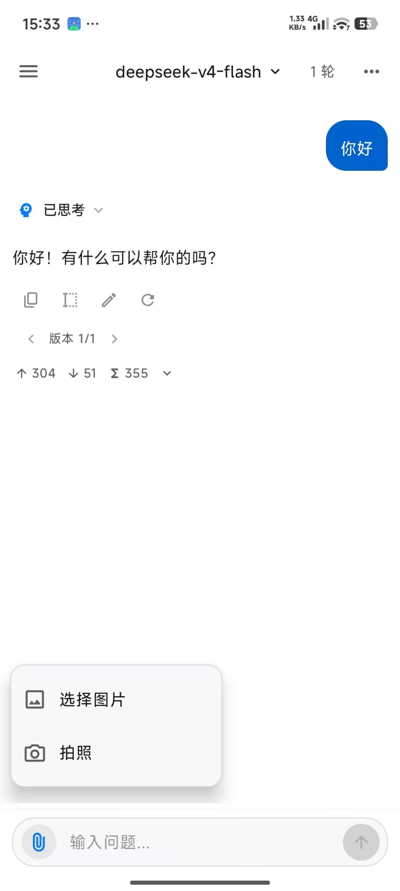<br><sub>相册与相机附件</sub></td>
    <td align="center">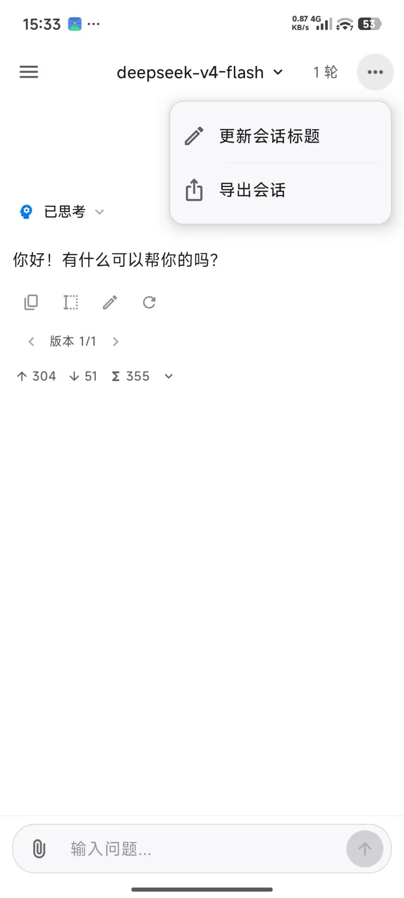<br><sub>会话操作</sub></td>
    <td align="center">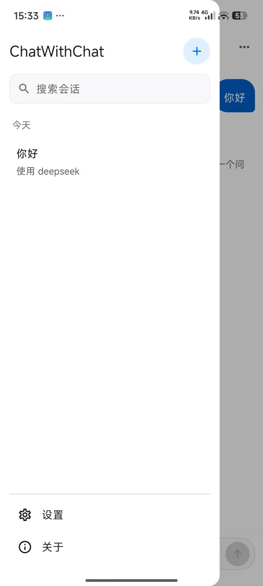<br><sub>会话历史</sub></td>
  </tr>
  <tr>
    <td align="center">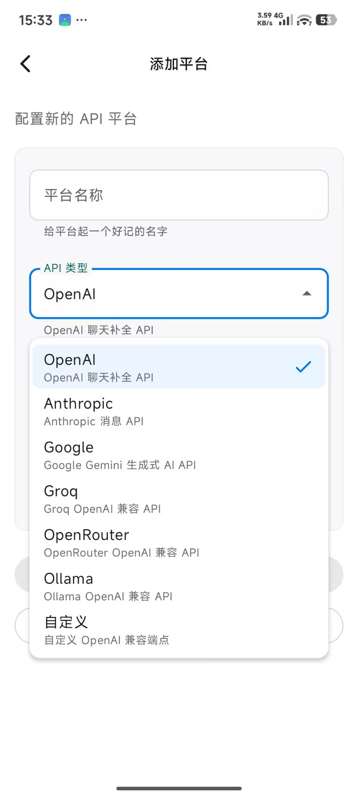<br><sub>添加模型服务</sub></td>
    <td align="center">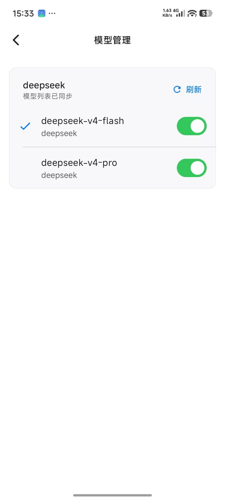<br><sub>模型列表管理</sub></td>
    <td align="center">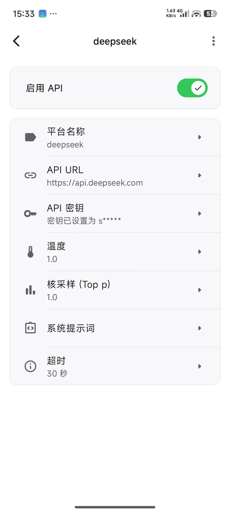<br><sub>平台详细设置</sub></td>
  </tr>
  <tr>
    <td align="center">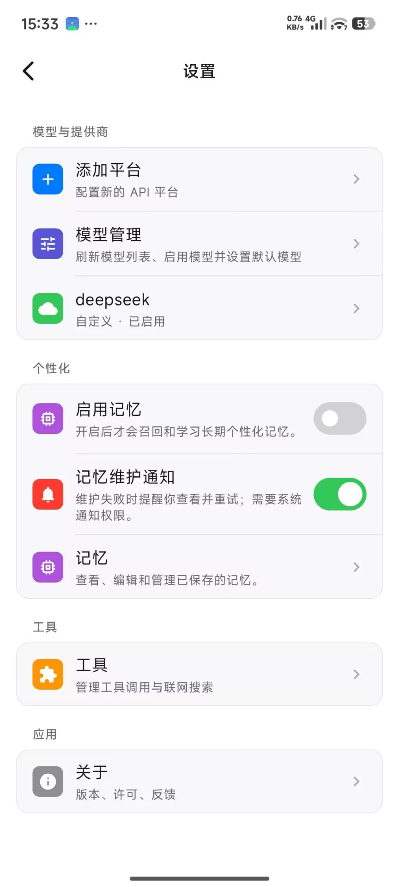<br><sub>应用设置</sub></td>
    <td align="center">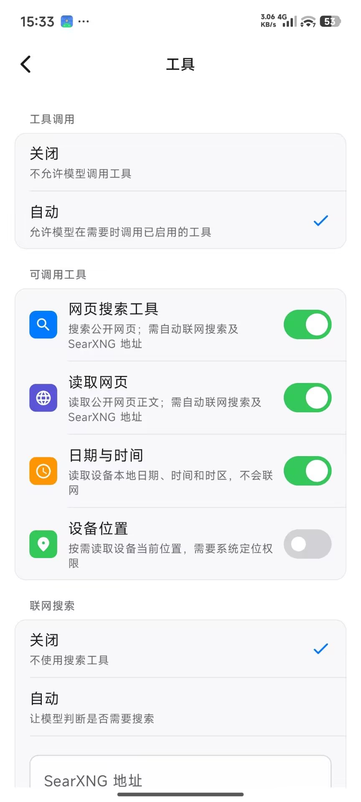<br><sub>工具与联网搜索</sub></td>
    <td align="center"><br><sub>长期记忆</sub></td>
  </tr>
</table>

## 支持的模型服务

添加平台后，应用会从服务端同步模型列表。你可以选择启用的模型、设置默认模型，并为支持的模型选择自动、关闭、低、中、高或最高思考强度。

| 服务类型 | 对话协议 | 工具调用路径 |
| --- | --- | --- |
| OpenAI | Responses API | 原生工具调用 |
| Anthropic | Messages API | 原生工具调用 |
| Google Gemini | Generate Content API | 原生工具调用 |
| OpenRouter | OpenAI Chat Completions | 原生工具调用 |
| Groq | OpenAI 兼容接口 | 结构化 JSON 回退 |
| Ollama | 本地 / 局域网 OpenAI 兼容接口 | 结构化 JSON 回退 |
| Custom | 自定义 OpenAI 兼容接口 | 结构化 JSON 回退 |

不同服务和模型支持的思考参数、视觉输入、上下文长度与工具能力并不完全一致，最终行为仍取决于目标端点的实际兼容程度。

### 推理与思考过程

应用把统一的思考强度转换为各服务实际接受的参数，包括 OpenAI reasoning effort、Anthropic thinking budget、Gemini thinking config、Groq reasoning 字段和 OpenAI 兼容请求参数。通过 Custom 类型连接 `api.deepseek.com` 且模型 ID 包含 `deepseek` 时，应用会发送官方 DeepSeek 使用的 `thinking: {"type":"enabled"}` 配置。

返回链路同时处理以下来源：

- OpenAI Responses API 的 reasoning summary 事件。
- OpenAI 兼容流中的 `reasoning_content` 与 `reasoning` 字段。
- 跨多个 SSE 分片出现的 `<think>...</think>` 与 `<thinking>...</thinking>` 标签。
- 普通对话和工具循环后续轮次中的思考内容。

解析后的思考文本通过 `ApiState.Thinking -> MessageV2.thoughts -> ThinkingBlock` 独立于最终回答保存和展示。结构化字段与标签同时出现时会按来源优先级去重；流结束时仍未闭合的思考标签不会被静默丢弃。

## 快速开始

### 安装发布版

1. 下载 [ChatWithChat v1.0.0 APK](https://github.com/NaBr406/ChatWithChat/releases/download/v1.0.0/1.0.0.apk)。
2. 如需校验完整性，确认 SHA-256 为 `446c645efeed83b9948fce9bc56435e716d44701c647b123fb1cc0adec5f0347`。
3. 在 Android 12 或更高版本设备上打开 APK，并按系统提示允许当前来源安装应用。

### 首次配置

运行要求：

- Android 12（API 31）或更高版本。
- 至少一个可访问的模型服务端点。
- 对云端服务使用对应 API 密钥；Ollama 可在不配置密钥的情况下使用。

首次启动后：

1. 选择提供商类型并填写平台名称、API URL 与凭据。
2. 等待应用同步模型列表，然后启用至少一个模型。
3. 回到聊天首页，从顶部模型选择器选择模型与思考强度。
4. 如有需要，在设置中单独开启长期记忆、联网搜索或其他工具。

如果 Android 设备需要连接电脑上运行的 Ollama，请填写电脑在局域网中的地址；Android 设备里的 `localhost` 指向设备自身。

## 工具调用与联网搜索

工具总开关提供“关闭”和“自动”两种模式。自动模式下，模型可以在当前请求需要时调用已启用工具。当前内置工具均为只读工具：

| 工具 | 用途 | 启用条件 |
| --- | --- | --- |
| `web_search` | 搜索公开网页并返回结构化来源 | 工具调用为自动、联网搜索为自动，并已配置 SearXNG URL |
| `fetch_url` | 读取公开网页正文 | 与网页搜索相同 |
| `current_datetime` | 读取设备本地日期、时间与时区 | 工具调用为自动 |
| `device_location` | 按需读取设备当前位置 | 默认关闭，需要用户主动启用并授予 Android 定位权限 |

工具执行前会检查当前启用列表、参数 schema、调用次数、超时、结果大小和 Android 权限。模型生成的调用不会自行弹出系统授权窗口；缺少权限时，应用会返回可恢复错误，由用户决定是否授权。

当前不支持 MCP、远程动态工具、插件市场或任意第三方工具下载。工具平台的扩展方式和安全边界见 [工具调用开发指南](./docs/superpowers/tool-calling.md)。

## 长期记忆

长期记忆默认关闭，并且不是简单地把完整聊天记录拼回提示词。开启后，应用只记录包含成功助手回答的已完成轮次，将其存入 Room 的待处理队列；每个不可变批次最多 5 轮，在达到 5 轮、用户空闲 30 分钟或发生上下文压缩时进入后台维护流程。

### 实现分层

| 层级 | 实现与职责 |
| --- | --- |
| 权威内容 | `filesDir/memory_store/MEMORY.md` 是普通聊天召回的唯一事实源；`memory/YYYY-MM-DD.md` 只作为维护输入，蒸馏进入 `MEMORY.md` 前不会参与普通召回 |
| 调度状态 | Room schema 17 保存待处理轮次、聊天检查点、维护任务、活动日志、变更组、变更回执、语料代次和日蒸馏检查点 |
| 语义整理 | 使用平台列表中首个已启用且已选择模型的兼容平台，把对话批次转换为受约束的 `create`、`replace`、`remove` 或 `ignore` 操作 |
| 一致性提交 | `MemoryMutationCoordinator` 通过幂等键、目标哈希、暂存文件、原子替换和 Room compare-and-set 状态推进提交，避免进程终止后重复写入或回滚新内容 |
| 本地向量化 | 校验固定版本和 SHA-256 的 `bge-small-zh-v1.5` ONNX 资产，在设备上生成 512 维 CLS/L2 向量；该步骤不会调用云端 embedding 服务 |
| 派生索引 | ObjectBox 5.4.2 HNSW 位于 `noBackupFilesDir/memory_vector_index`，只保存可从当前 Markdown 重建的派生状态，不拥有权威内容 |
| 召回 | `HybridMemoryRetriever` 对当前 `MEMORY.md` 同时进行关键词和向量检索，再做融合、去重、多样化和 Token 预算装箱；索引缺失、过期或损坏时永久回退到当前 Markdown 关键词召回 |
| 可见性 | 记忆页提供权威 Markdown 的只读查看与导出，以及模型调用、记忆生成、组织结果、重试和失败原因的活动日志 |

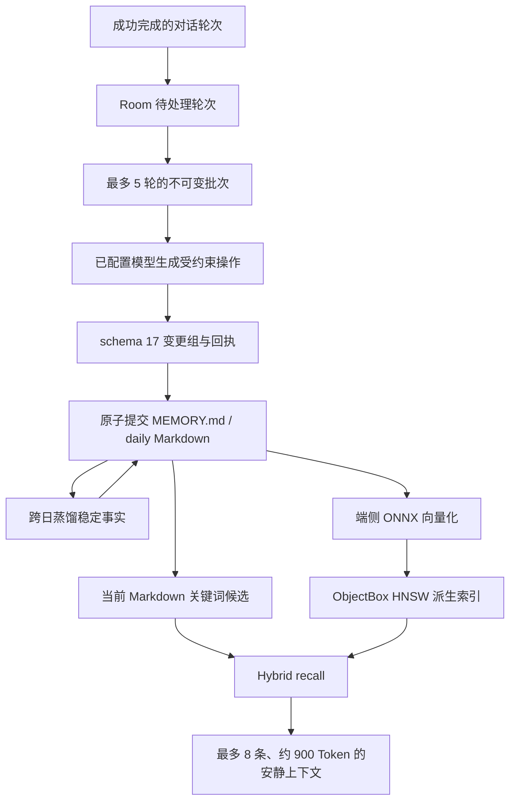

召回查询由最新用户消息和最近 6 条上下文组成，先取最多 24 个候选，再在约 900 Token 的预算内选择最多 8 条。私密或敏感记忆会保留敏感度元数据，并在注入提示中要求仅在当前请求确有需要时使用，不能因为被召回就主动暴露。

### 恢复与降级

应用启动时会先恢复未完成的变更回执，再进行语料 bootstrap 和向量索引对账。有效租约仍在运行的任务不会被抢占；过期或无主任务通过 CAS 完成恢复。若暂存文件缺失、哈希冲突或目标内容已经写入，恢复流程会分别终止、标记冲突或幂等完成，而不是覆盖当前 `MEMORY.md`。

ObjectBox 索引可以安全删除并从 Markdown 重建。模型资产缺失、损坏、版本不匹配，或者向量快照不新鲜时，embedding capability 保持 `NOT_PROVISIONED`，普通聊天仍使用当前 Markdown 的关键词结果；不会联网下载模型、调用云端 embedding 或使用伪向量替代。

语义整理和日蒸馏仍会调用已配置的对话模型，因此可能产生额外 API 请求与用量。更完整的 schema 17、进程恢复、备份模拟、生产 Hybrid shadow 与 16 KB 验证证据见 [端侧向量记忆就绪文档](./docs/architecture/on-device-vector-memory-readiness.md)，固定模型来源与哈希见 [端侧记忆模型资产契约](./docs/architecture/on-device-vector-memory-artifact-contract.md)。

## 数据与隐私边界

“本地优先”描述的是数据归属和默认存储位置，不代表所有功能都能离线运行。

| 数据或操作 | 存储 / 传输边界 |
| --- | --- |
| 聊天、平台和运行状态 | 保存在应用私有 Room 数据库中；平台记录包含 API URL 与凭据 |
| 应用偏好 | 保存在应用私有 DataStore 中 |
| API 凭据 | 没有经过项目自建服务器，但当前也没有额外的应用层加密 |
| 普通对话与模型列表同步 | 直接请求所选模型服务端点 |
| 联网搜索 | 查询发送到用户配置的 SearXNG；网页正文由应用从公开 URL 读取 |
| 长期记忆语义整理 | 完成轮次、已有记忆和受约束整理提示会发送到已配置的模型服务；模型返回的操作在本地校验后才允许提交 |
| 长期记忆召回 | Markdown、Room 控制状态、ONNX embedding 和 ObjectBox 检索均在设备端运行；普通召回不会调用云端 embedding |
| 设备位置 | 仅在用户主动启用并授权后读取；调用结果会进入所选模型的对话上下文 |
| Android 备份 | `MEMORY.md`、日记忆、Room 和 DataStore 当前符合系统备份条件；暂存/回滚目录、ObjectBox 索引和运行时模型副本不进入备份 |

备份 XML 只显式排除 `memory_store/.staging/` 和 `memory_store/.backups/`。ObjectBox 与运行时安装的模型位于 `noBackupFilesDir`，恢复后从权威 Markdown 或 APK 资产重新建立。Room、DataStore、平台凭据和权威记忆是否实际进入云备份或设备迁移，仍取决于设备设置和 Android 备份 transport；当前 API 凭据没有额外的应用层加密，使用系统备份前应理解这一边界。

## 本地开发

### 环境要求

- JDK 17。
- Android Studio 与 Android SDK 36。
- Windows PowerShell，或能运行 Gradle Wrapper 的类 Unix 环境。
- 设备测试需要 Android 12+ 真机或模拟器。

项目是单 `app` 模块，`namespace` 与 `applicationId` 均为 `cn.nabr.chatwithchat`。

```powershell
git clone https://github.com/NaBr406/ChatWithChat.git
Set-Location ChatWithChat

# Debug APK
.\gradlew.bat :app:assembleDebug

# Kotlin 快速编译检查
.\gradlew.bat :app:compileDebugKotlin

# JVM 单元测试
.\gradlew.bat :app:testDebugUnitTest

# 连接设备后的 instrumented tests
.\gradlew.bat :app:connectedDebugAndroidTest
```

macOS / Linux 下将 `.\gradlew.bat` 替换为 `./gradlew`。代码格式由 ktlint 1.3.1 按 `.editorconfig` 在 Pull Request 中检查。

### Windows 构建脚本

```powershell
# 默认构建 arm64-v8a Debug APK，输出到 dist/
.\build-apk.ps1

# 为 x86_64 模拟器构建
.\build-apk.ps1 -TargetAbi x86_64

# 构建、安装并启动 Debug APK
.\run-on-emulator.ps1

# 复用已有 Debug APK
.\run-on-emulator.ps1 -NoBuild
```

`build-apk.ps1` 也接受 `armeabi-v7a` 和 `x86`，但当前生产兼容验证重点是 `arm64-v8a` 与 `x86_64`；32 位 ABI 仍需单独验证。

### Release 构建

生产 Release 包含固定版本、固定哈希的端侧记忆模型。模型二进制不提交到 Git，干净工作区需要先准备并校验资产：

```powershell
.\tools\memory-model\provision-bge-small-zh-v1.5-production.ps1
.\gradlew.bat :app:verifyProductionMemoryModelArtifacts :app:assembleRelease
.\gradlew.bat :app:bundleRelease
```

也可以使用仓库脚本完成模型准备、单 ABI 构建、签名和 APK 检查：

```powershell
.\build-apk.ps1 -Release
```

未传入 `-Keystore` 时，脚本会使用本机 Debug keystore 生成便于安装验证的 Release 变体。正式分发必须传入自己的发布 keystore，并妥善管理密钥与密码。模型资产的来源和完整性约束见 [端侧记忆模型资产契约](./docs/architecture/on-device-vector-memory-artifact-contract.md)。

发布验证脚本会检查固定模型资产、Release R8 构建、APK 16 KB ZIP 对齐，以及 ObjectBox / ONNX Runtime 原生库的 ELF 对齐；连接设备后还可以扩展到运行时门禁：

```powershell
# 构建并检查 Release APK
.\tools\memory-vector\verify-release.ps1

# 在 PAGE_SIZE=16384 的设备或模拟器上要求 16 KB 运行时证据
.\tools\memory-vector\verify-release.ps1 -RunDeviceTests -Require16KbPageSize

# 运行真实 ONNX + ObjectBox 的生产 Hybrid shadow
.\tools\memory-vector\run-production-hybrid-shadow.ps1
```

当前 `arm64-v8a` 与 `x86_64` 的目标原生库已经通过 16 KB ELF 对齐验证。`armeabi-v7a` 与 `x86` 仍属于单独的 32 位支持策略，不应把 64 位门禁结论直接外推到 32 位产物。

## 架构概览

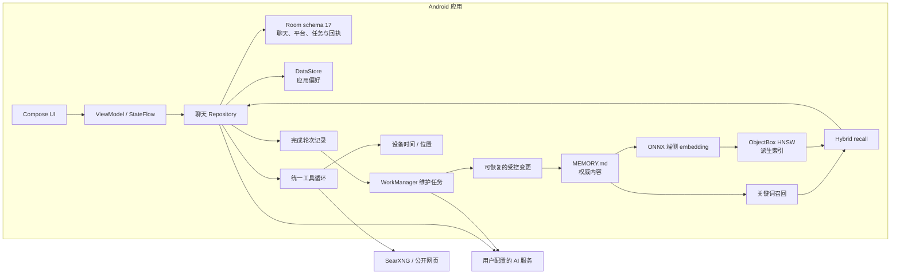

主要代码目录：

- `app/src/main/kotlin/cn/nabr/chatwithchat/presentation/`：Compose UI、导航与 ViewModel。
- `app/src/main/kotlin/cn/nabr/chatwithchat/data/network/`：各模型服务的网络客户端。
- `app/src/main/kotlin/cn/nabr/chatwithchat/data/repository/`：聊天、设置、附件、模型发现、推理流解析和记忆上下文装配。
- `app/src/main/kotlin/cn/nabr/chatwithchat/data/tool/`：工具注册、执行、安全策略与 provider adapter。
- `app/src/main/kotlin/cn/nabr/chatwithchat/data/websearch/`：SearXNG 搜索、网页提取与网络安全策略。
- `app/src/main/kotlin/cn/nabr/chatwithchat/data/memory/`：批次整理、日蒸馏、原子变更、恢复、Markdown、端侧 embedding、ObjectBox 与 Hybrid recall。
- `app/src/main/kotlin/cn/nabr/chatwithchat/data/database/`：Room entity、DAO、schema migration，以及记忆任务、回执和语料代次状态。
- `app/src/test/kotlin/`、`app/src/androidTest/kotlin/`：JVM 与设备测试。

技术栈包括 Kotlin、Jetpack Compose、Material 3、Hilt、Room、DataStore、WorkManager、Ktor CIO、kotlinx.serialization、ObjectBox 与 ONNX Runtime。

## CI 与发布流程

- Pull Request 会执行 ktlint 检查；相关代码变更会触发 Debug APK 构建。
- CodeQL 在 Pull Request 和每周定时任务中运行。
- 推送标签或手动触发 Release workflow 时，会准备记忆模型、构建并签名 APK / AAB，再上传为 Actions artifact。
- 当前 CI 不会运行完整 JVM / 设备测试，也不会自动创建 GitHub Release；Actions artifact 与正式发布仍是两个独立步骤。
- `v1.0.0` 已作为正式 GitHub Release 发布，公开资产为 [`1.0.0.apk`](https://github.com/NaBr406/ChatWithChat/releases/download/v1.0.0/1.0.0.apk)。

提交代码前，请至少运行与修改范围对应的单元测试和 `:app:compileDebugKotlin`；数据库、记忆、权限或 Android 生命周期改动还应补充设备测试。

## 反馈

- [提交 Bug](https://github.com/NaBr406/ChatWithChat/issues/new/choose)
- [查看 GitHub Actions](https://github.com/NaBr406/ChatWithChat/actions)

报告问题时，请附上 Android 版本、提供商类型、模型 ID、API URL 类型、复现步骤，以及必要的截图或 logcat 片段。请勿公开 API 密钥、完整请求头或其他敏感信息。

## 项目背景与许可证

ChatWithChat 基于 [GPT Mobile](https://github.com/Taewan-P/gpt_mobile) 持续改造，现使用独立的项目身份与 Android 包名 `cn.nabr.chatwithchat`。旧的 `dev.chungjungsoo.gptmobile` 安装包不会被 Android 视为本项目的原地升级版本，两者的数据也不会自动迁移。

本项目按 [GNU General Public License v3.0](./LICENSE) 发布。应用内“开源许可”页面列出了所使用第三方依赖的许可证信息。
