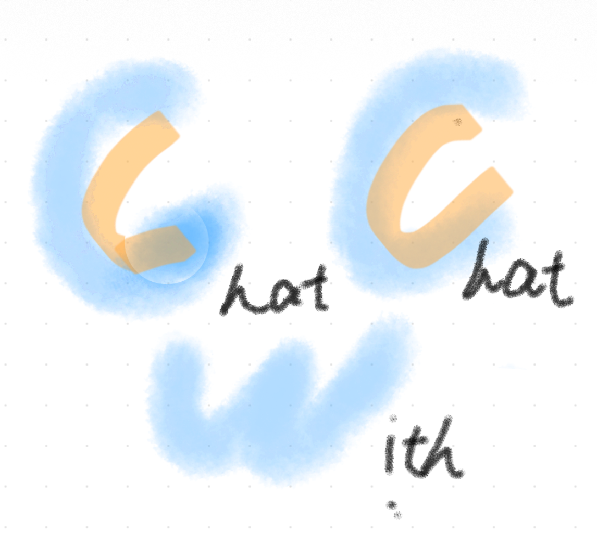
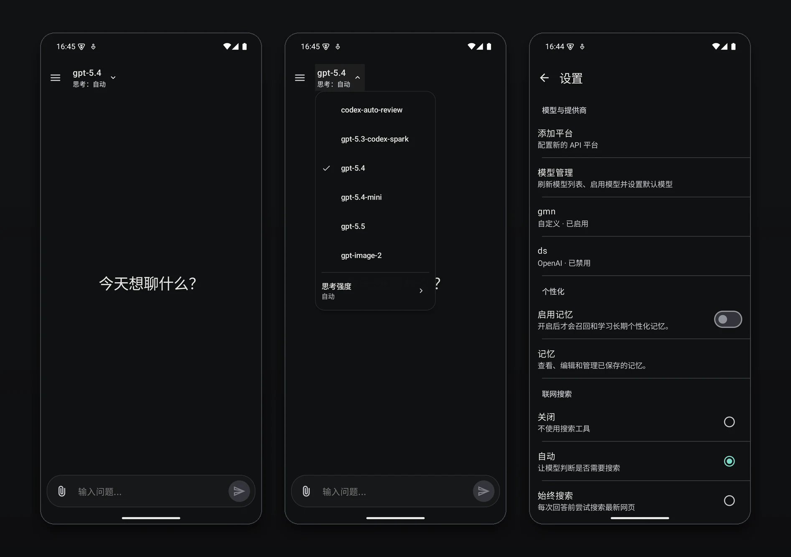

<div align="center">



# ChatWithChat

### 面向 Android 的多模型聊天助手：打开就能聊，也可以让多个 AI 提供商一起回答。

<p>
  
  
  
  <a href="https://github.com/NaBr406/ChatWithChat/actions/workflows/debug-build.yml"></a>
  <a href="https://github.com/NaBr406/ChatWithChat/actions/workflows/release-build.yml"></a>
</p>

</div>

## 项目状态

ChatWithChat 是基于 GPT Mobile 深度改造的 Android AI 聊天应用。当前分支已经从“设置好平台再进入传统会话列表”的体验，调整为更接近 ChatGPT / Gemini 手机端的工作流：首屏就是聊天输入，左侧抽屉管理历史会话，顶部直接切换模型。

这个仓库的用户可见品牌、README、图标资源和本地构建产物名称已经面向 ChatWithChat 调整；为了降低迁移风险，内部包名、部分类名、数据库名和 Android `applicationId` 仍保留 `dev.chungjungsoo.gptmobile` / `GPTMobile` 相关命名。

## 截图

<div align="center">



</div>

## 主要功能

- 多提供商聊天
  - 支持 OpenAI、Anthropic、Google Gemini、Groq、Ollama、OpenRouter 和自定义 OpenAI 兼容端点。
  - 支持为每个平台配置 API URL、API 密钥、默认模型、系统提示词、温度、Top P 和流式超时。
  - 支持按 URL 拉取可用模型列表，再启用模型和设置默认模型。
- 更直接的移动端聊天体验
  - 首屏直接输入问题，未配置平台时引导添加第一个提供商。
  - 顶部模型选择器支持单模型聊天，也保留多平台对比会话能力。
  - 左侧历史抽屉支持新建会话、搜索、复制和批量删除。
- 本地优先的数据设计
  - 聊天记录、平台配置、模型列表和长期记忆都保存在本机 Room / DataStore 中。
  - API 密钥只保存在本地；聊天时仅发送到你配置的模型服务端点。
- 长期记忆
  - 可开启跨会话个性化记忆，由模型负责分类、召回和学习。
  - 记忆页支持查看、确认、拒绝、编辑、标记已解决、归档、删除和 Markdown 导出。
- 消息与附件能力
  - 支持 Markdown、代码块复制、数学公式渲染、助手思考过程展示。
  - 支持编辑用户消息和助手消息、重试回答、查看不同回答版本、导出会话。
  - 当前附件入口以图片为主，会在上传前做大小校验和大图压缩。
- Android 体验
  - Kotlin + Jetpack Compose + Material 3 + Hilt + MVVM。
  - 支持动态主题、深色模式、Android 13+ 应用内语言。

## 支持的模型服务

| 类型 | 默认端点 / 说明 | 模型发现 |
| --- | --- | --- |
| OpenAI | `https://api.openai.com/`，支持 Chat Completions / Responses 相关能力 | `/v1/models` |
| Anthropic | `https://api.anthropic.com/` | `/v1/models` |
| Google Gemini | Google Generative AI API | `/v1beta/models` |
| Groq | OpenAI 兼容接口 | `/v1/models` |
| Ollama | 本地或局域网 Ollama 服务 | `/api/tags` |
| OpenRouter | OpenAI 兼容接口 | `/v1/models` |
| Custom | 任意 OpenAI 兼容 API | `/v1/models` |

## 本地开发

环境要求：

- Windows PowerShell 或类 Unix shell。
- JDK 17。
- Android SDK，`minSdk 31`，`targetSdk 36`。

常用命令：

```powershell
.\gradlew.bat :app:assembleDebug
.\gradlew.bat :app:compileDebugKotlin
.\gradlew.bat test
.\gradlew.bat :app:assembleRelease
.\gradlew.bat :app:bundleRelease
```

Windows 本机也提供了两个辅助脚本：

```powershell
# 默认构建 arm64-v8a 单 ABI APK，并复制到 dist/
.\build-apk.ps1

# 为 x86_64 模拟器构建单 ABI APK
.\build-apk.ps1 -TargetAbi x86_64

# 构建、安装并启动到已连接设备或模拟器
.\run-on-emulator.ps1

# 复用已有 debug APK 安装启动
.\run-on-emulator.ps1 -NoBuild
```

如果只是改 Compose UI，通常先跑：

```powershell
.\gradlew.bat :app:compileDebugKotlin
```

如果改到数据库、Repository、网络或导出逻辑，再补充相关单元测试或 `test`。

## 发布与下载

当前仓库以源码构建和本地 APK 验证为主：

- 源码仓库：<https://github.com/NaBr406/ChatWithChat>
- CI 构建：<https://github.com/NaBr406/ChatWithChat/actions>
- Release 页面：<https://github.com/NaBr406/ChatWithChat/releases>

旧 README 中的 F-Droid、Google Play、下载量、Weblate 和上游 Star History 徽章都属于原 GPT Mobile 项目；在 ChatWithChat 未建立独立发布渠道前，这里不再继续展示，避免把用户带到上游应用页面。

## 反馈与问题

- Bug 报告：<https://github.com/NaBr406/ChatWithChat/issues/new/choose>
- 功能建议与讨论：<https://github.com/NaBr406/ChatWithChat/discussions>

提交问题时请尽量附上：

- 设备或模拟器版本。
- 使用的提供商、模型 ID 和 API URL 类型。
- 可复现步骤、截图或录屏。
- 如果是崩溃，附上相关 logcat 片段。

## 代码结构

- `app/src/main/kotlin/dev/chungjungsoo/gptmobile/data/`：Room、DataStore、Repository、网络和记忆逻辑。
- `app/src/main/kotlin/dev/chungjungsoo/gptmobile/presentation/`：Compose UI、导航、主题和图标。
- `app/src/main/res/`：Android 资源、字符串、图标和启动页配置。
- `app/src/test/kotlin/`：单元测试。
- `docs/superpowers/`：阶段性设计文档和实施计划。
- `metadata/en-US/`：商店元数据草稿。

## 许可证

本项目继承原项目的 GPL-3.0 许可证。详见 [LICENSE](./LICENSE)。
